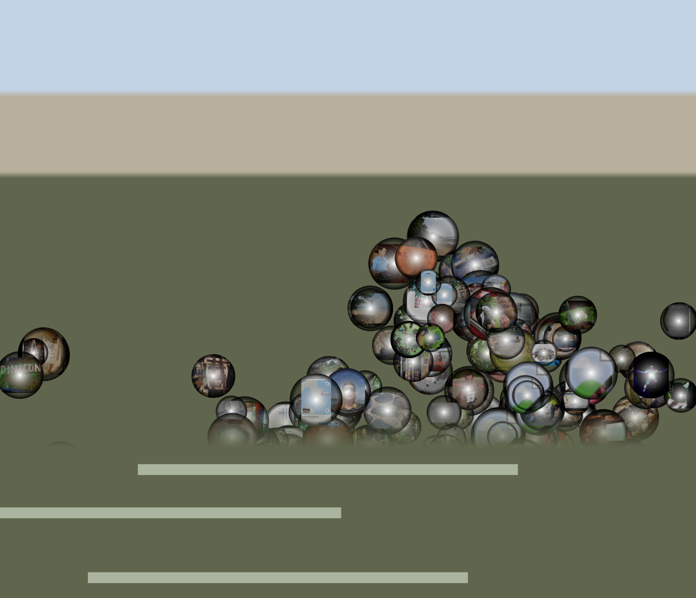

# Tidal Memories

Tidal Memories is a visualization of Riot Matrix photos from [Dinacon
2018](https://www.dinacon.org).

Photos are positioned up and down the intertidal zone according to the tide
level when they were taken (or, at least, posted to Riot). They are positioned
horizontally from midnight, to midnight the following day.

Mouse over a photo to see its details.

The tide indicates the current tide in Ko Lone, Phuket. At high tide, you won't
see much.



## Related

[Matrix-gallery](https://github.com/osteele/matrix-gallery) is a more
conventional photo gallery.

## Develop

### Setup

Install Pipenv: `pipenv install`.

Set `API_SERVER_URL` to the address of a
[matrix-gallery](https://github.com/osteele/matrix-gallery) server.

### Run

Run the front end (client):

```shell
$ pipenv run client
```

or:

```shell
$ cd client
$ yarn install
$ yarn start
```

## License

MIT
